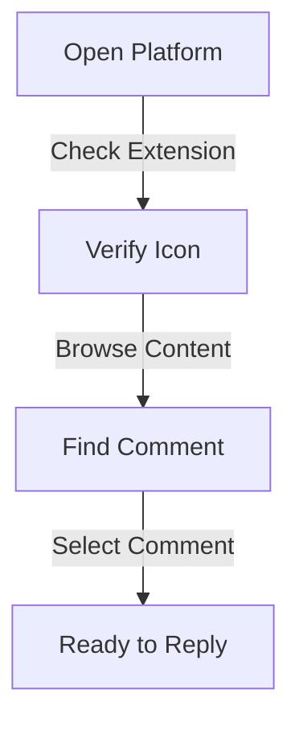

## What is Reply to Comments?

Reply to Comments is Olly.social's innovative engagement tool that enables users to interact meaningfully with comments on their social media posts. This feature allows for direct engagement with existing comments, fostering community discussions and building stronger connections. By selecting any comment, users can generate thoughtful replies that maintain conversation flow while saving time on response crafting.

<CardGrid>
  <Card
    subtitle="Get Started"
    title="Quick Setup"
    description="Learn how to set up and start using the Reply to Comments feature in minutes."
    href="/docs/features/reply-to-comments/setup"
  />
  <Card
    subtitle="Tutorial"
    title="Usage Guide"
    description="Step-by-step instructions for engaging with your audience effectively."
    href="/docs/features/reply-to-comments/guide"
  />
  <Card
    subtitle="Support"
    title="Help Center"
    description="Get assistance and troubleshooting tips for Reply to Comments."
    href="/docs/support"
  />
</CardGrid>

## Who Will This Feature Help?

### 1. New Customers
First-time users can benefit through:
- Asking questions about products and services
- Getting insights from experienced users
- Building confidence in purchasing decisions
- Accessing community knowledge
- Receiving authentic user testimonials

### 2. Brand Advocates
Loyal customers can enhance their support by:
- Sharing positive experiences
- Providing helpful recommendations
- Building credibility within the community
- Offering product usage tips
- Supporting potential customers

### 3. Health Influencers
Influencers can strengthen their presence by:
- Providing personalized advice
- Engaging directly with followers
- Sharing expert insights
- Building credibility
- Fostering meaningful discussions

### 4. Customer Support Seekers
Users needing assistance can:
- Voice concerns directly
- Receive prompt support
- Resolve issues efficiently
- Track support conversations
- Access community solutions

### 5. Community Builders
Community leaders can foster engagement through:
- Initiating wellness discussions
- Encouraging experience sharing
- Creating meaningful connections
- Building supportive networks
- Facilitating knowledge exchange

## Feature Overview
The Reply to Comments feature functions as a comprehensive engagement tool that:
* Enables direct response to specific comments
* Maintains conversation context
* Facilitates community building
* Streamlines engagement workflow

## How to Use Olly's "Reply to Comments"

### Step 1: Access Social Media
1. Open your preferred social media platform
2. Ensure Olly's Chrome extension is active
3. Verify the extension icon in your toolbar
4. Browse through your feed

### Step 2: Select Comment
1. Locate the comment you want to respond to
2. Click on the comment to select it
3. Wait for Olly's popup window to appear

### Step 3: Generate Reply
1. Look for the reply icon (↩️) in the popup
2. Click the "↩️ Generate Reply" option
3. Review generated response
4. Customize as needed before posting

## Benefits

### Engagement Enhancement
- Active community participation
- Increased interaction rates
- Deeper audience connections
- Meaningful conversations
- Enhanced user experience

### Community Development
- Stronger user relationships
- Knowledge sharing
- Supportive environment
- Brand loyalty building
- User-generated content

### Support Excellence
- Quick response times
- Contextual assistance
- Issue resolution tracking
- Community-driven solutions
- Customer satisfaction

## Troubleshooter's Guide

If you experience issues with Reply to Comments:

1. Verify extension installation
2. Check browser compatibility
3. Confirm internet connection
4. Clear browser cache if needed
5. Contact support for persistent issues

For additional support or feature requests, visit our [Help Center](/docs/support) or join our [Community Forum](/community).
