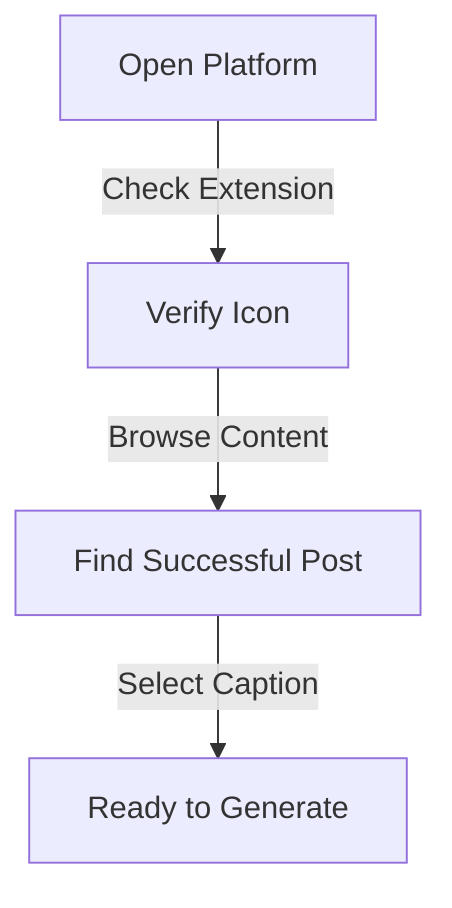

## What is Similar Post Generator?

The Similar Post Generator is Olly.social's innovative content creation tool that helps users craft engaging posts inspired by successful content. When you find a caption that resonates with your goals, simply select it and let our AI generate fresh variations that capture the same energy. This powerful feature combines advanced analysis with content optimization to help maintain consistent engagement while saving valuable time.

<CardGrid>
  <Card
    subtitle="Get Started"
    title="Quick Setup"
    description="Learn how to set up and start using the Similar Post Generator in minutes."
    href="/docs/features/similar-post-generator/setup"
  />
  <Card
    subtitle="Tutorial"
    title="Usage Guide"
    description="Step-by-step instructions for creating engaging content variations."
    href="/docs/features/similar-post-generator/guide"
  />
  <Card
    subtitle="Support"
    title="Help Center"
    description="Get assistance and troubleshooting tips for the Similar Post Generator."
    href="/docs/support"
  />
</CardGrid>

## Who Will This Feature Help?

### 1. Content Creator's
Content creators can enhance their content strategy by:
- Maintaining consistent quality across platforms
- Generating variations while preserving their unique voice
- Exploring new angles to engage audiences
- Maintaining active posting schedules
- Balancing creativity with efficiency

### 2. Social Media Manager's
Social media managers can optimize their workflow through:
- Transforming successful posts into new content
- Maintaining consistent brand voice
- Streamlining content calendar planning
- Testing different engagement approaches
- Scaling content production efficiently

### 3. Marketer's
Marketers can improve their campaigns by:
- Scaling successful content strategies
- Generating data-driven variations
- Optimizing engagement rates
- Testing new messaging angles
- Improving conversion rates

### 4. Business Owner's
Business owners can save time and resources by:
- Converting proven content into multiple opportunities
- Maintaining professional social media presence
- Generating industry-relevant content
- Preserving brand consistency
- Maximizing content creation efficiency

### 5. Influencer's
Influencers can maintain their momentum through:
- Expanding upon engaging content
- Preserving authentic voice
- Exploring new connection methods
- Maintaining active presence
- Strengthening personal brand

## Feature Overview
The Similar Post Generator functions as an intelligent content creation tool that:
* Analyzes successful posts to understand engagement factors
* Generates multiple fresh variations
* Maintains original tone and style
* Allows customization for brand alignment

## How to Use Olly's "Similar Post Generator"

### Step 1: Access Social Media
1. Open your preferred social media platform
2. Ensure Olly's Chrome extension is active
3. Verify the extension icon in your toolbar
4. Browse through your feed

### Step 2: Select Content
1. Find a successful post that aligns with your goals
2. Highlight the caption text
3. Wait for Olly's popup window to appear

### Step 3: Generate Variations
1. Look for the refresh icon (🔄) in the popup
2. Click the "🔄 Generate Similar Posts" option
3. Review generated variations
4. Click refresh icon again for more options

## How It Works

### Caption Analyst's
- Advanced AI examination of:
  * Content structure
  * Tone and voice
  * Key engagement elements
  * Message patterns
  * Style characteristics

### Content Generator's
- AI-powered creation process:
  * Maintains core message
  * Preserves engagement factors
  * Creates fresh perspectives
  * Ensures originality
  * Maintains brand consistency

### Customization Expert's
- Fine-tuning capabilities:
  * Adjust tone and style
  * Modify key messaging
  * Align with brand voice
  * Optimize for platforms
  * Personalize content

## Benefits

### Time Manager's
- Rapid content creation
- Streamlined workflow
- Reduced writing time
- Quick iterations
- Efficient scaling

### Content Expert's
- Consistent messaging
- Professional output
- Proven frameworks
- Engagement optimization
- Brand alignment

### Strategist's
- Data-driven variations
- Testing capabilities
- Performance insights
- Audience targeting
- Campaign optimization

## Troubleshooter's Guide

If you experience issues with the Similar Post Generator:

1. Confirm extension installation
2. Check browser compatibility
3. Verify internet connection
4. Clear browser cache if needed
5. Contact support for persistent issues

For additional support or feature requests, visit our [Help Center](/docs/support) or join our [Community Forum](/community).
