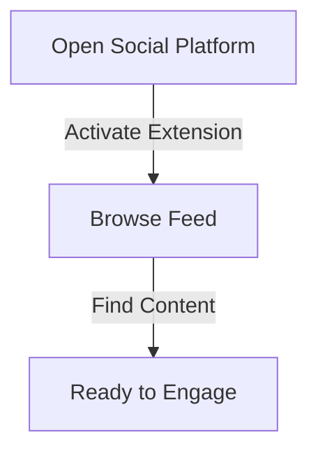

## What is Comment Generator?

The AI-powered comment generator is one of Olly.social's core features, designed to help users engage meaningfully across social media platforms. It works by analyzing the context of posts and generating personalized comments that feel authentic and relevant to the conversation.

<CardGrid>
  <Card
    subtitle="Get Started"
    title="Quick Setup"
    description="Learn how to set up and start using the Comment Generator in minutes."
    href="/docs/features/comment-generator/setup"
  />
  <Card
    subtitle="Tutorial"
    title="Usage Guide"
    description="Step-by-step instructions for generating engaging comments."
    href="/docs/features/comment-generator/guide"
  />
  <Card
    subtitle="Support"
    title="Help Center"
    description="Get assistance and troubleshooting tips for the Comment Generator."
    href="/docs/support"
  />
</CardGrid>

## Who Will This Feature Help?

### 1. Founder
Early-stage founders can maintain an active social media presence without compromising core business responsibilities:
- Build valuable networks by engaging with investor updates
- Participate in industry discussions
- Connect with potential team members
- Establish thought leadership
- Stay visible while focusing on business growth

### 2. Social Media Manager
Social media managers juggling multiple client accounts will find Olly invaluable for:
- Maintaining consistent engagement across platforms
- Creating tailored responses while preserving brand voice
- Automating routine engagement tasks
- Focusing on strategy and creative content
- Saving hours of manual commenting

### 3. Marketing Manager
Marketing managers can streamline their social media engagement by:
- Managing customer feedback efficiently
- Creating personalized, brand-appropriate responses
- Maintaining consistent brand voice
- Acknowledging customer experiences
- Handling multiple platform interactions

### 4. Influencers & Content Creators
Content creators and influencers benefit from:
- Managing high engagement volumes
- Maintaining consistent interaction with followers
- Focusing on content production
- Ensuring community engagement
- Supporting growth and sponsor relationships

### 5. Student
Students can enhance their academic networking by:
- Participating in academic discussions
- Creating professional responses
- Engaging with industry news
- Commenting on research papers
- Building professional networks

## How to Use Olly's "Comment Generator"

### Step 1: Navigate to Social Media
1. Open your preferred social media platform (LinkedIn, Twitter, Instagram, etc.)
2. Ensure Olly's Chrome extension is active in your browser
3. Browse through your feed to find posts you want to engage with

### Step 2: Select Post Caption
1. Click and highlight the post's text content or caption
2. Wait for Olly's popup window to appear
3. Your comment will be automatically generated

### Step 3: Choose Comment Option
1. Locate the "Comment" button in the popup menu
2. Click to activate the comment generator
3. Review and customize generated comment

### Step 4: Alternative Method
1. Generate Comments directly in the comment section
2. Use pre-set buttons for different comment types
3. Create custom persona buttons for your engagement style

## Best Practices

| Tip | Description |
|-----|-------------|
| **Personalization** | Review and customize generated comments for authenticity |
| **Timing** | Engage with content soon after it's posted |
| **Variety** | Use different comment styles to maintain natural engagement |
| **Brand Voice** | Ensure comments align with your brand personality |
| **Context** | Consider the post's context before engaging |

## Troubleshooting

If you encounter issues while using the Comment Generator:

1. Verify the extension is properly installed
2. Check your browser compatibility
3. Ensure you have an active internet connection
4. Contact support if issues persist

For additional support or feature requests, visit our [Help Center](/docs/support) or join our [Community Forum](/community).
