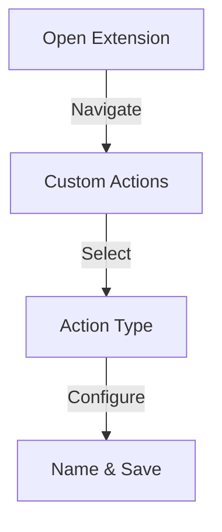

## What is Custom Actions?

The Custom Actions feature in Olly v2.0 allows users to create personalized workflows by defining their own prompts and actions, such as generating stories or summaries. This update enhances flexibility, enabling users to tailor Olly's capabilities to their specific needs. Additionally, users can edit these actions over time, making it easier to refine their interactions. This feature is particularly beneficial for agencies and enterprises, as it facilitates the creation of AI personalities that can generate customized comments from various expert perspectives.

<CardGrid>
  <Card
    subtitle="Get Started"
    title="Quick Setup"
    description="Learn how to set up and start using Custom Actions in minutes."
    href="/docs/features/custom-actions/setup"
  />
  <Card
    subtitle="Tutorial"
    title="Usage Guide"
    description="Step-by-step instructions for creating personalized workflows."
    href="/docs/features/custom-actions/guide"
  />
  <Card
    subtitle="Support"
    title="Help Center"
    description="Get assistance and troubleshooting tips for Custom Actions."
    href="/docs/support"
  />
</CardGrid>

## Who Will This Feature Help?

### 1. Social Media Manager's
Social media managers can streamline their workflows by:
- Creating personalized actions tailored to different clients
- Automating repetitive tasks across multiple platforms
- Saving significant time on routine tasks
- Focusing on strategic planning
- Enhancing content development processes

### 2. Content Creator's
Content creators can leverage Custom Actions by:
- Generating unique content ideas through custom prompts
- Enhancing creativity with AI-generated suggestions
- Maintaining fresh, engaging content
- Ensuring niche-relevant content
- Building stronger audience connections

### 3. Digital Marketing Agency's
Digital marketing agencies can optimize their services by:
- Creating specialized AI personalities
- Customizing engagement strategies
- Enhancing campaign effectiveness
- Providing personalized client service
- Meeting diverse marketing goals

### 4. Influencer's
Influencers can enhance their presence by:
- Maintaining consistent brand voice
- Designing unique style-reflecting actions
- Improving audience engagement
- Fostering stronger follower connections
- Enhancing overall online presence

### 5. Multilingual User's
Multilingual users can expand their reach by:
- Designing language-specific actions
- Customizing regional content
- Engaging diverse audiences
- Creating culturally resonant messaging
- Building wider audience connections

## How to Use Olly's "Custom Actions"

### Step 1: Accessing Social Media
1. Open the Olly.Social browser extension
2. Navigate to the Custom Action section
3. Select your desired action type
4. Name your custom action (examples):
   - Content Checker
   - Post Analyst
   - Quiz Generator
5. Add an identifying emoji to your action and save it

### Step 2: Post Selection Process
1. Refresh the webpage
2. Locate the post you want to analyze
3. Select the text content:
   * Click and drag over the post's caption or text
   * Ensure the desired content is fully highlighted
4. Wait for Olly's popup window to appear

### Step 3: Checking the Analysis
1. Look for the emojis indicators (☺️) in the popup window
2. Click the corresponding emoji for your custom action
3. Allow Olly to process the content
4. Review the generated analysis or output

## Benefits

### Personalization Expert's
- Enables tailored interactions
- Enhances brand identity
- Customizes user experience
- Maintains consistent voice
- Adapts to specific needs

### Management Pro's
- Simplifies social media workflow
- Creates customized processes
- Streamlines daily tasks
- Improves efficiency
- Reduces manual work

### Integration Specialist's
- Supports multi-platform engagement
- Ensures consistent messaging
- Facilitates cross-platform management
- Maintains brand coherence
- Enhances content distribution

### Engagement Master's
- Facilitates relevant interactions
- Drives user engagement
- Improves audience connection
- Enhances content impact
- Builds stronger relationships

For additional support or feature requests, visit our [Help Center](/docs/support) or join our [Community Forum](/community).
