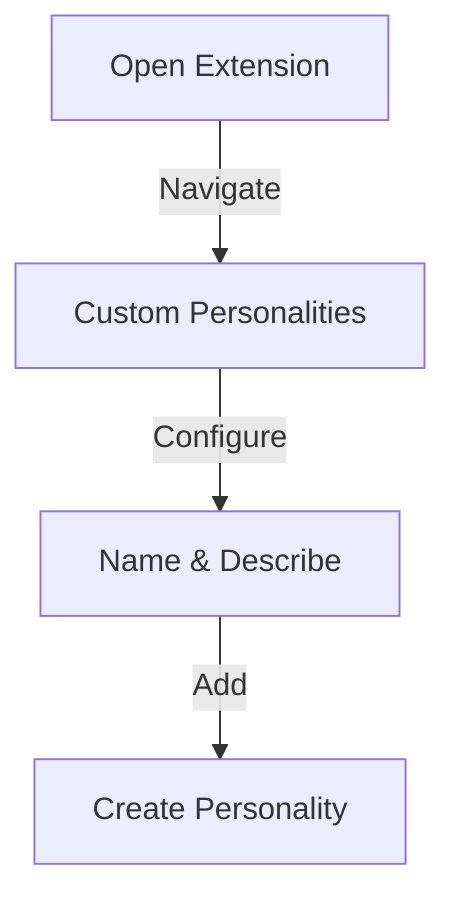

## What are Custom Personalities?

The Custom Personalities feature allows users to define specific AI personas that generate personalized comments and interactions based on tailored prompts. This functionality enhances engagement by enabling the creation of responses from various expert perspectives, such as digital marketing or e-commerce specialists. By utilizing these custom personalities, users can ensure their social media interactions are relevant and resonate more deeply with their target audience. This feature is particularly beneficial for agencies and large enterprises, as it helps maintain a consistent and professional brand voice across multiple platforms while effectively engaging with diverse audiences.

<CardGrid>
  <Card
    subtitle="Get Started"
    title="Quick Setup"
    description="Learn how to set up and start using Custom Personalities in minutes."
    href="/docs/features/custom-personalities/setup"
  />
  <Card
    subtitle="Tutorial"
    title="Usage Guide"
    description="Step-by-step instructions for creating expert AI personas."
    href="/docs/features/custom-personalities/guide"
  />
  <Card
    subtitle="Support"
    title="Help Center"
    description="Get assistance and troubleshooting tips for Custom Personalities."
    href="/docs/introduction"
  />
</CardGrid>

## Who Will This Feature Help?

### 1. The Digital Marketing Expert's
This persona generates insights and comments tailored to marketing strategies, helping businesses:
- Improve online presence
- Enhance engagement metrics
- Provide expert marketing advice
- Optimize digital strategies
- Drive marketing success

### 2. The E-commerce Specialist's
Focused on online retail, this personality helps businesses by:
- Crafting sales-driven responses
- Enhancing customer service
- Connecting with potential buyers
- Optimizing product messaging
- Improving conversion rates

### 3. The Social Media Guru's
This persona specializes in social media optimization by:
- Providing engagement strategies
- Navigating current trends
- Optimizing content reach
- Improving interaction rates
- Maximizing social impact

### 4. The Customer Relationship Manager's
Designed for relationship building, this personality focuses on:
- Fostering customer connections
- Addressing concerns thoughtfully
- Demonstrating empathy
- Understanding customer needs
- Building lasting relationships

### 5. The Content Creator's
This persona enhances content strategy by:
- Generating creative ideas
- Maintaining content flow
- Creating engaging material
- Supporting brand consistency
- Inspiring new perspectives

## How to Use Olly's "Custom Personalities"

### Step 1: Accessing Social Media
1. Open the Olly.Social browser extension

2. Navigate to the Custom Personalities section

3. Name your Custom Personalities (e.g., "Marketer")

4. Describe expertise with custom prompt:
   - Example: "Act like an expert Marketer. Create comments like you have lots of knowledge about Marketing"
5. Click on add custom button to create your personality

### Step 2: Post Selection Process
1. Refresh the webpage
2. Locate the post you want to analyze
3. Click on the comment section where you find your Custom Personalities buttons

### Step 3: Checking the Analysis
1. Click the corresponding custom button
2. Wait for the AI to generate a personality-specific comment
3. Review the generated analysis or output

## Benefits

### Engagement Expert's
- Generates personalized responses
- Resonates with target audiences
- Enhances user interaction
- Creates meaningful connections
- Drives engagement metrics

### Knowledge Master's
- Provides specialized insights
- Offers expert perspectives
- Delivers valuable advice
- Shares industry knowledge
- Enhances comment quality

### Brand Guardian's
- Maintains voice consistency
- Strengthens brand identity
- Ensures professional tone
- Unifies messaging strategy
- Builds brand recognition

### Service Champion's
- Enhances customer relationships
- Addresses inquiries thoughtfully
- Shows genuine empathy
- Resolves concerns effectively
- Builds customer loyalty

For additional support or feature requests, visit our [Help Center](/docs) or join our [Community Forum](/community).
