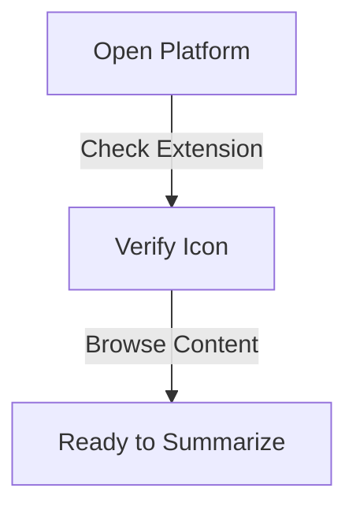

## What is Post Summarizer?

The Post Summarizer is one of Olly.social's powerful AI features, designed to condense lengthy articles, posts, or documents into concise, digestible summaries. This tool automatically extracts key points from content and presents them in an easily readable format, helping users quickly grasp essential information without reading through extensive text.

<CardGrid>
  <Card
    subtitle="Get Started"
    title="Quick Setup"
    description="Learn how to set up and start using the Post Summarizer in minutes."
    href="/docs/features/post-summarizer/setup"
  />
  <Card
    subtitle="Tutorial"
    title="Usage Guide"
    description="Step-by-step instructions for creating effective content summaries."
    href="/docs/features/post-summarizer/guide"
  />
  <Card
    subtitle="Support"
    title="Help Center"
    description="Get assistance and troubleshooting tips for the Post Summarizer."
    href="/docs/support"
  />
</CardGrid>

## Who Will This Feature Help?

### 1. Social Media Manager
Social media managers can enhance their content strategy by:
- Quickly distilling lengthy discussions into key points
- Crafting engaging posts based on summarized content
- Monitoring and responding to audience discussions efficiently
- Creating more focused and impactful content
- Improving overall engagement rates

### 2. Content Creator/Influencer
Content creators can optimize their workflow through:
- Extracting essential information from trending topics
- Creating timely and relevant content
- Understanding audience interests more effectively
- Maintaining consistent content quality
- Increasing content production efficiency

### 3. Academic Researcher
Researchers can streamline their work by:
- Condensing complex research papers
- Sharing key findings more effectively
- Improving research comprehension
- Creating presentation materials faster
- Managing literature reviews efficiently

### 4. Marketing Specialist
Marketing professionals can enhance their strategies by:
- Analyzing competitor content quickly
- Identifying industry trends
- Developing data-driven marketing approaches
- Creating effective campaign summaries
- Monitoring market responses efficiently

### 5. Event Planner
Event coordinators can improve their planning through:
- Summarizing event feedback effectively
- Identifying key attendee expectations
- Creating concise event briefs
- Managing stakeholder communications
- Optimizing future event planning

## Feature Overview
The Post Summarizer functions as an intelligent analysis tool within Olly that:
* Provides instant content summaries through the Chrome extension
* Analyzes and condenses text while you browse
* Delivers quick insights with a simple highlight-and-summarize process
* Integrates seamlessly with other Olly features

## How to Use Olly's "Post Summarizer"

### Step 1: Access Social Media
1. Open your preferred social media platform
2. Ensure Olly's Chrome extension is active
3. Verify the extension icon in your toolbar
4. Browse through your feed

### Step 2: Select Content
1. Find the content you want to summarize
2. Click and highlight the text content
3. Wait for Olly's popup window to appear

### Step 3: Generate Summary
1. Look for the document icon (📝) in the popup
2. Click the "📝 Summarize" option
3. Review the generated summary
4. Access detailed analysis if needed

## Benefits

### Time Efficiency
- Rapid information processing
- Quick content comprehension
- Streamlined workflow
- Reduced reading time
- Improved productivity

### Enhanced Understanding
- Clearer content presentation
- Simplified complex ideas
- Better information retention
- Focused key points
- Improved learning outcomes

### Content Management
- Organized information storage
- Priority identification
- Efficient content categorization
- Better information hierarchy
- Streamlined documentation

## Troubleshooting

If you experience issues with the Post Summarizer:

1. Confirm extension installation
2. Check browser compatibility
3. Verify internet connection
4. Clear browser cache if needed
5. Contact support for persistent issues

For additional support or feature requests, visit our [Help Center](/docs/support) or join our [Community Forum](/community).
