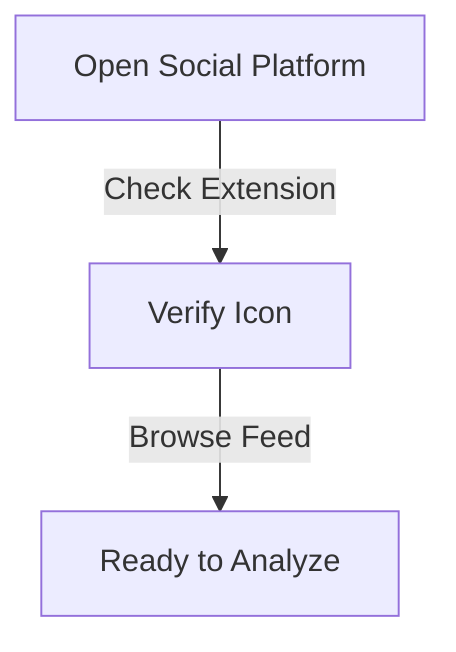

## What is Virality Checker?

The virality checker is one of Olly.social's powerful features, designed to help users analyze and optimize their social media content for maximum impact. It works through Olly's Chrome extension, providing instant content scoring and engagement potential analysis while you browse social media platforms.

<CardGrid>
  <Card
    subtitle="Get Started"
    title="Quick Setup"
    description="Learn how to set up and start using the Virality Checker in minutes."
    href="/docs/features/virality-checker/setup"
  />
  <Card
    subtitle="Tutorial"
    title="Usage Guide"
    description="Step-by-step instructions for analyzing content virality."
    href="/docs/features/virality-checker/guide"
  />
  <Card
    subtitle="Support"
    title="Help Center"
    description="Get assistance and troubleshooting tips for the Virality Checker."
    href="/docs/support"
  />
</CardGrid>

## Who Will This Feature Help?

### 1. Social Media Manager
Social media managers can optimize their content strategy by:
- Assessing post potential before scheduling
- Creating more effective content strategies
- Improving brand visibility
- Making data-driven content decisions
- Maximizing engagement rates

### 2. Event Coordinator
Event coordinators can enhance their event promotion by:
- Identifying high-impact promotional content
- Maximizing event visibility
- Optimizing posting timing
- Increasing attendance rates
- Engaging potential attendees effectively

### 3. Content Creator/Influencer
Content creators can refine their content strategy through:
- Analytics-driven content creation
- Audience engagement optimization
- Content performance prediction
- Trend identification
- Improved audience retention

### 4. Business Owner/Entrepreneur
Entrepreneurs can maximize their social media impact by:
- Optimizing content for maximum reach
- Increasing brand awareness
- Improving customer engagement
- Managing marketing budgets effectively
- Identifying trending topics

### 5. Data Analyst
Data analysts can leverage the tool for:
- Tracking social media performance
- Creating data-driven strategies
- Analyzing engagement patterns
- Measuring content effectiveness
- Generating performance reports

## Feature Overview
The virality checker works as a smart analysis tool within Olly that:
* Provides instant content scoring through the Chrome extension
* Analyzes post potential while you browse social media
* Delivers quick insights with a simple highlight-and-check process
* Complements Olly's other social media management features

## How to Use Olly's "Virality Checker"

### Step 1: Access Social Media
1. Open your preferred social media platform
2. Ensure Olly's Chrome extension is active
3. Verify the extension icon in your toolbar
4. Browse through your feed

### Step 2: Select Post Content
1. Find the post you want to analyze
2. Click and highlight the post's text content
3. Wait for Olly's popup window to appear

### Step 3: Check Virality Score
1. Look for the flame icon (🔥) in the popup
2. Click the "🔥 Virality" option
3. Review the generated score and insights
4. Access detailed analytics if needed

## Troubleshooting

If you experience issues with the Virality Checker:

1. Confirm extension installation
2. Check browser compatibility
3. Verify internet connection
4. Clear browser cache if needed
5. Contact support for persistent issues

For additional support or feature requests, visit our [Help Center](/docs/support) or join our [Community Forum](/community).
